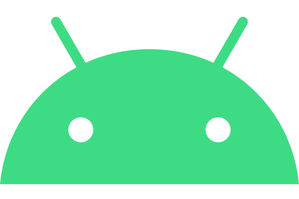

<div align="center">
  

  

  <br />

  

  <h2>Android không chỉ là hệ điều hành, mà Android còn là một hệ tư tưởng.</h2>

  <p>
    I build mobile products with practical architecture, stable releases, polished UI, and the backend or web systems needed to support them.
  </p>

  <p>
    <a href="https://thangbeo-dev-resume.vercel.app/">
      
    </a>
    <a href="https://www.linkedin.com/in/thanguit/">
      
    </a>
    <a href="https://github.com/thang-uit">
      
    </a>
    <a href="https://www.youtube.com/channel/UCqRIlPMyax3ReAyzMr4GXlg">
      
    </a>
  </p>
</div>

---

## Mobile Engineering Focus

<table>
  <tr>
    <td width="50%">
      <h3>Product Mobile</h3>
      <p>
        Native Android, iOS ecosystem awareness, Flutter, React Native, responsive UI, app lifecycle, permissions, deep links, push notifications, analytics, and release preparation.
      </p>
    </td>
    <td width="50%">
      <h3>Production Systems</h3>
      <p>
        Backend APIs, CMS workflows, PostgreSQL, Redis, Firebase, Crashlytics, CI-ready structure, environment hygiene, and maintainable documentation.
      </p>
    </td>
  </tr>
  <tr>
    <td width="50%">
      <h3>UI and Experience</h3>
      <p>
        Recruiter-facing interfaces, mobile-first layouts, theme systems, localization, image galleries, lightweight animation, and accessibility-conscious interaction states.
      </p>
    </td>
    <td width="50%">
      <h3>Engineering Habits</h3>
      <p>
        Clean naming, small components, explicit data models, testable flows, careful dependency upgrades, readable README files, and production-minded verification.
      </p>
    </td>
  </tr>
</table>

## Tech Stack

<table>
  <tr>
    <td width="50%">
      <h3>Mobile</h3>
      <p>
        
        
        
        
        
        
      </p>
    </td>
    <td width="50%">
      <h3>Frontend</h3>
      <p>
        
        
        
        
        
      </p>
    </td>
  </tr>
  <tr>
    <td width="50%">
      <h3>Backend and Data</h3>
      <p>
        
        
        
        
        
      </p>
    </td>
    <td width="50%">
      <h3>Tooling</h3>
      <p>
        
        
        
        
        
      </p>
    </td>
  </tr>
</table>

## How I Build

```text
Mobile first
  -> understand the user flow
  -> design stable UI states
  -> keep data and presentation separate
  -> integrate APIs, notifications, analytics, and crash monitoring
  -> verify on real screen sizes
  -> document enough for the next developer
```

## GitHub Signal

<div align="center">
  
  <br />
  
  
  
  <br />
  
</div>

## Connect

<div align="center">
  <a href="https://thangbeo-dev-resume.vercel.app/">
    
  </a>
  <a href="https://www.linkedin.com/in/thanguit/">
    
  </a>
  <a href="https://www.facebook.com/ThangUIT2018/">
    
  </a>
  <a href="https://www.instagram.com/thang_uit/">
    
  </a>
  <a href="https://www.youtube.com/channel/UCqRIlPMyax3ReAyzMr4GXlg">
    
  </a>
</div>

<div align="center">
  
</div>
